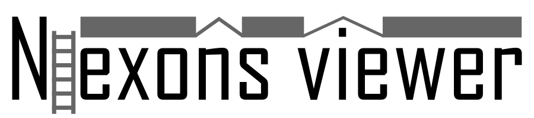
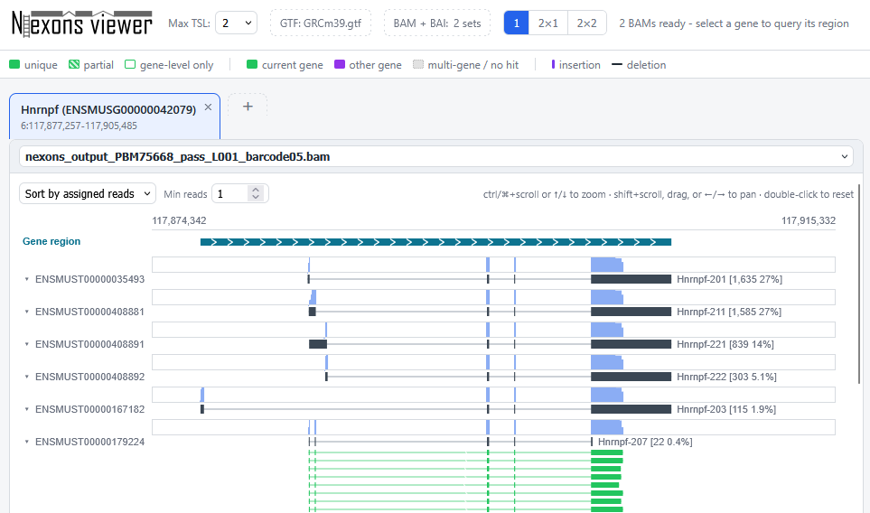

A web-based genome data viewer for comparing local BAM alignments generated by [nexons](https://github.com/s-andrews/nexons/) against transcript models from a GTF file.



# Using Nexons Viewer

After running nexons to quantitate your aligned nanopore data you can access the viewer directly online at

https://www.bioinformatics.babraham.ac.uk/nexons-viewer/

To start using it simply do the following:

1. Select the GTF file you used to run nexons.
2. Optionally, choose the maximum transcript support level with the **Max TSL** control before selecting the file. Use **All** to avoid filtering by TSL.
3. Select nexons annotated BAM files together with their matching BAI index files (you can generate these with samtools index). You can select multiple BAM/BAI pairs at once.
4. Open your first gene with the `+` gene tab control, then choose 1, 2, or 4 panels to compare loaded BAMs.


All data is read locally from your machine.  No data is sent to the server to make the viewer run.


# License

Nexons Viewer is licensed under the GNU General Public License version 3. See [LICENSE](LICENSE) for the full license text.

Copyright (C) 2026 Oliver Slay and Simon Andrews.


# Developing Nexons Viewer

## Prerequisites

- Node.js 20.19 or newer (Node.js 22.12 or newer is also supported)
- npm, which is installed with Node.js

This is a Vite + React + TypeScript application. All genome files are selected from your browser and processed locally; you do not need a backend server to run the viewer.

## Local Install

From the project directory:

```bash
npm install
```

If you are setting up from a clean checkout and want npm to install exactly the versions in `package-lock.json`, use:

```bash
npm ci
```

## Run Locally

Start the development server:

```bash
npm run dev
```

Vite will print a local URL, usually:

```text
http://localhost:5173/nexons-viewer/
```

Open that URL in a browser.


## Build

Create a production build:

```bash
npm run build
```

The compiled files are written to `dist/`.

The application is built with `/nexons-viewer/` as its public base path. For a one-off build hosted at the domain root, override it with:

```bash
npm run build -- --base=/
```

Preview the production build locally:

```bash
npm run preview
```

Vite will print the preview URL.

## Deploy On Red Hat Distrubution behind an Apache proxy

This deployment runs the production build with the repository's dependency-free Node.js static server on `127.0.0.1:4173`. Apache exposes it at `https://example.com/nexons-viewer/`. The application processes selected GTF, BAM, and BAI files in the browser; these files are not uploaded to the server.

Do not use `npm run preview` as the production service. Vite documents that command as a local build preview rather than a production server.

### 1. Install prerequisites

Install Apache, Node.js 20.19 or newer, npm, Git, and the SELinux management utilities:

```bash
sudo dnf install httpd nodejs npm git policycoreutils-python-utils
node --version
```

Vite 8 requires Node.js 20.19 or newer, or Node.js 22.12 or newer. If the packaged Node.js is older, install a supported release from your organisation's approved repository before continuing.

Create a dedicated, non-login service account and application directory:

```bash
sudo useradd --system --create-home --shell /sbin/nologin nexons-viewer
sudo install -d -o nexons-viewer -g nexons-viewer /opt/nexons-viewer
sudo -u nexons-viewer git clone <REPOSITORY_URL> /opt/nexons-viewer
```

### 2. Install and build

Install the locked dependencies and create the production build:

```bash
cd /opt/nexons-viewer
sudo -u nexons-viewer npm ci
sudo -u nexons-viewer npm run build
```

Confirm that `dist/index.html` exists. The build already targets `/nexons-viewer/`; no server-side source edits are required.

### 3. Create the systemd service

Create `/etc/systemd/system/nexons-viewer.service`:

```ini
[Unit]
Description=Nexons Viewer static web service
After=network.target

[Service]
Type=simple
User=nexons-viewer
Group=nexons-viewer
WorkingDirectory=/opt/nexons-viewer
Environment=NODE_ENV=production
Environment=HOST=127.0.0.1
Environment=PORT=4173
ExecStart=/usr/bin/node /opt/nexons-viewer/server.mjs
Restart=on-failure
RestartSec=5s
NoNewPrivileges=true
PrivateTmp=true
ProtectSystem=strict
ProtectHome=true
ProtectKernelTunables=true
ProtectKernelModules=true
ProtectControlGroups=true
RestrictSUIDSGID=true

[Install]
WantedBy=multi-user.target
```

Check the Node.js path with `command -v node` and adjust `ExecStart` if it is not `/usr/bin/node`. Then load and start the service:

```bash
sudo systemctl daemon-reload
sudo systemctl enable --now nexons-viewer.service
sudo systemctl status nexons-viewer.service
curl --head http://127.0.0.1:4173/
```

Use the standard systemd commands to manage it:

```bash
sudo systemctl start nexons-viewer.service
sudo systemctl stop nexons-viewer.service
sudo systemctl restart nexons-viewer.service
sudo journalctl -u nexons-viewer.service -f
```

### 4. Configure Apache as the reverse proxy

Ensure the proxy modules are loaded:

```bash
sudo httpd -M | grep -E 'proxy_module|proxy_http_module'
```

Create `/etc/httpd/conf.d/nexons-viewer.conf` inside the appropriate HTTP or HTTPS virtual host configuration:

```apache
RedirectMatch 301 ^/nexons-viewer$ /nexons-viewer/

ProxyPass        /nexons-viewer/ http://127.0.0.1:4173/
ProxyPassReverse /nexons-viewer/ http://127.0.0.1:4173/
```

Keep the trailing slash on both sides of each proxy rule. Apache will remove the public `/nexons-viewer/` prefix before requesting files from the loopback service.

On an SELinux-enforcing server, allow Apache to connect to the loopback service:

```bash
sudo setsebool -P httpd_can_network_connect 1
```

Validate and reload Apache:

```bash
sudo apachectl configtest
sudo systemctl enable --now httpd.service
sudo systemctl reload httpd.service
```

If the host firewall does not already allow web traffic, enable the services appropriate to the virtual host:

```bash
sudo firewall-cmd --permanent --add-service=http
sudo firewall-cmd --permanent --add-service=https
sudo firewall-cmd --reload
```

Open `https://example.com/nexons-viewer/` and confirm that the browser developer tools show JavaScript, CSS, worker, favicon, and logo requests under `/nexons-viewer/` with successful responses.

### 5. Deploy updates

Stop the application while replacing the build, update the checkout, rebuild, and start it again:

```bash
sudo systemctl stop nexons-viewer.service
cd /opt/nexons-viewer
sudo -u nexons-viewer git pull --ff-only
sudo -u nexons-viewer npm ci
sudo -u nexons-viewer npm run build
sudo systemctl start nexons-viewer.service
sudo systemctl status nexons-viewer.service
```

Apache can remain running during application updates. A `503 Service Unavailable` is expected while the backend service is stopped.

## Lint

Run the configured Oxlint checks:

```bash
npm run lint
```

## Troubleshooting

If `node` or `npm` is not recognized after installing Node.js, close and reopen your terminal so it picks up the updated PATH.

If `npm install` or `npm ci` fails with `UNABLE_TO_GET_ISSUER_CERT_LOCALLY`, configure npm or Node.js to trust your local/corporate certificate authority, then rerun the install command.

## Available Scripts

- `npm run dev` - start the Vite development server with hot reload
- `npm run build` - type-check with TypeScript and build the production bundle
- `npm run preview` - serve the production build locally
- `npm start` - serve the built `dist/` directory on loopback for production proxying
- `npm run lint` - run Oxlint
